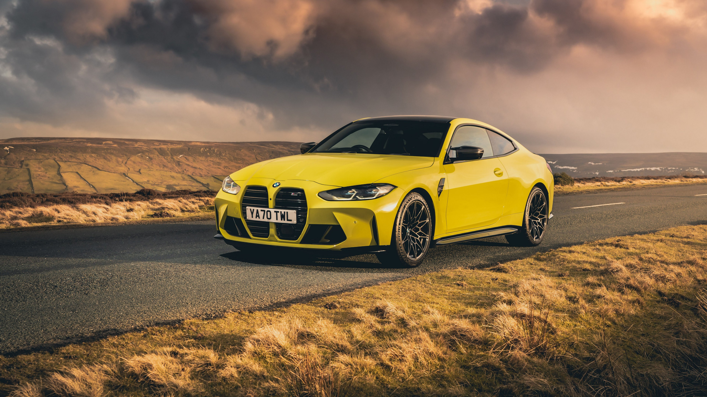

# ASCII-Art-using-Python

***Requirements***

1) **Install libraries**
   - pygame
   - opencv-python
   - numba
   - numpy 

2) **Add any photos you like to convert to the input folder**
 

***Resultat***
- Input 

- Output (ASCII photo colored)

